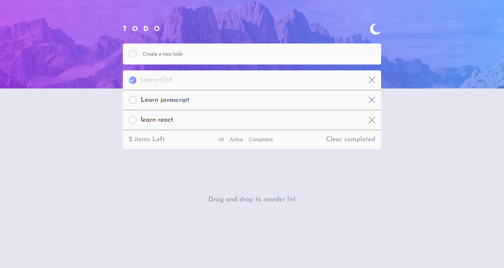

# Frontend Mentor - Todo app solution

This is a solution to the [Todo app challenge on Frontend Mentor](https://www.frontendmentor.io/challenges/todo-app-Su1_KokOW). Frontend Mentor challenges help you improve your coding skills by building realistic projects. 

## Table of contents

- [Overview](#overview)
  - [The challenge](#the-challenge)
  - [Screenshot](#screenshot)
  - [Links](#links)
- [My process](#my-process)
  - [Built with](#built-with)
  - [What I learned](#what-i-learned)
  - [Continued development](#continued-development)
  - [Useful resources](#useful-resources)
- [Author](#author)


## Overview

### The challenge

Users should be able to:

- View the optimal layout for the app depending on their device's screen size
- See hover states for all interactive elements on the page
- Add new todos to the list
- Mark todos as complete
- Delete todos from the list
- Filter by all/active/complete todos
- Clear all completed todos
- Toggle light and dark mode
- **Bonus**: Drag and drop to reorder items on the list

### Screenshot





### Links

- Solution URL: [https://github.com/ibimina/todolist-app](https://github.com/ibimina/todolist-app)
- Live Site URL: [https://ibimina.github.io/todolist-app/](https://ibimina.github.io/todolist-app/)

## My process

### Built with


- CSS custom properties
- Flexbox
- Mobile-first workflow
- [React](https://reactjs.org/) - JS library


### What I learned

- I learnt to fetch data from a json file using the following methods
 GET - to fetch out data to be mapped in the li tag
 ```js
  useEffect(() => {
    const abortConst = new AbortController();

    fetch(url, { signal: abortConst.signal })
      .then((res) => {
        if (!res.ok) {
          throw Error("could not fetch data for the resource");
        }
        return res.json();
      })
      .then((d) => {
        setTodos(d);
        setIsLoading(false);
        setError(null);
      })
      .catch((err) => {
        if (err.name === "AbortError") {
          console.log("fetch abort");
        } else {
          setError(err.message);
          setIsLoading(false);
        }
      });
    return () => abortConst.abort();
  }, [url]);
```
 POST - to add new data
 ```js
 fetch("http://localhost:3000/todos", {
        method: "POST",
        headers: { "Content-Type": "application/json" },
        body: JSON.stringify(todo),
      })
```
 PUT - to update a value 
 ```js
 fetch("http://localhost:3000/todos/" + id, {
      method: "PUT",
      headers: { "Content-Type": "application/json" },
      body: JSON.stringify(ne),
    })
```
 DELETE - to delete 
```jsx
  fetch("http://localhost:3000/todos/" + id, {
          method: "DELETE",
        }).
```
- I learnt how to out data that fullfills a condition  using json url 
```js
 onClick={() => add("http://localhost:3000/todos?checked=false")
```

- I also learnt how to drag and drop items using beautiful dnd
For this to work properly I had to remove the React.strictMode and set the draggable id to a string
Although I discovered that when I click the active and completed buttons it reformats I guess its because I am fetcching from the json file, I tried it with an array but it dtill behaves the same. I will research more to discover why, when I do I will update the code

### Continued development
Continous learning of React framework, how to fetch data from a json file

### Useful resources

- [How to create a local json file and watch it update](https://www.youtube.com/watch?v=eao7ABGFUXs) - This helped me for in creating json file. I really liked this pattern and will use it going forward.

- [Learning the different methods to fetch data from a json file](https://jasonwatmore.com/post/2020/02/01/react-fetch-http-post-request-examples) - This helped me to add(post method) new todos,update(put method) values of the todo, delete(delete method) todos and post n

- [How to add a drag and drop listed items](https://www.freecodecamp.org/news/how-to-add-drag-and-drop-in-react-with-react-beautiful-dnd/amp/) - This is an amazing article which helped me finally understand drag and drop list items. I'd recommend it to anyone still learning this concept.


## Author

- Frontend Mentor - [@ibimina](https://www.frontendmentor.io/profile/ibimina)
- Twitter - [@ibiminaaH](https://www.twitter.com/ibiminaaH)


